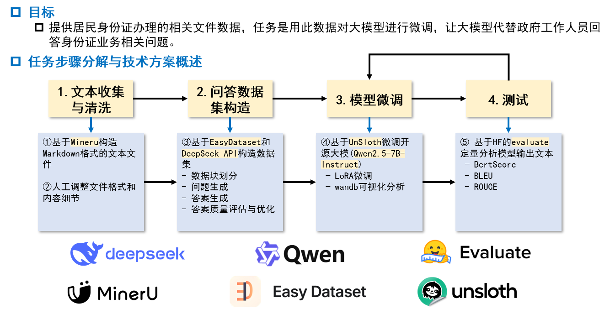

# LLM_FineTuning

提供居民身份证办理的相关文件数据，任务是用此数据对大模型进行微调，让大模型代替政府工作人员回答身份证业务相关问题。



### 1.安装依赖

```bash
pip install -r requirements.txt # 不建议这么粗暴地安装所有依赖，而是参考各个依赖库的官方文档，根据其教程正确安装。
```

### 2.准备数据集

数据集应包含以下字段：
- `instruction`：用户提问
- `input`：补充信息（可选）
- `output`：标准回答

将数据集放置在 `data/` 目录下，并在 `src/utils/config.py` 中配置数据集路径。
推荐使用数据集`data/v2/dataset_v2.json`，其中`data/v2/split`目录下的文件为该数据集的划分。
### 3.配置参数

修改 `src/utils/config.py` 文件中的配置参数：

```python
class GlobalConfig:
    seed = 32
    dataset_path = "./data/v2/"  # 数据集路径
    # 其他配置...

class SFTConfig(GlobalConfig):
    base_model_path = "/path/to/your/base/model"  # 基础模型路径
    per_device_train_batch_size = 8  # 批次大小
    learning_rate = 1e-4  # 学习率
    num_train_epochs = 5  # 训练轮数
    # 其他配置...
```

项目使用wandb进行实验跟踪，需要先注册wandb账号并登录。
如果不使用wandb，需要将`SFTConfig`中的`report_to`参数设置为`none`。

### 4.训练模型

```bash
python src/train.py
```

默认输出路径为 `outputs/[timestamp]/`，其中 `[timestamp]` 为训练开始时间的时间戳。其包含三方面内容：
- `checkpoints`：训练过程中保存的模型检查点
- `logs`：训练日志文件
- `lora_model`：历史最优(eval loss最低)的LoRA模型

### 5.推理使用

```bash
python src/inference.py --lora_path DIR_PATH_TO_LORA_MODEL
```

### 6.评估模型

#### 6.1 生成答案
使用示例:
```bash
python src/generation.py --exp_name 251212_172211 --data_path data/v2/dataset_v2.json --output_path results/251212_172211/answer.json --checkpoint 550
```
其中：
- `exp_name`：训练实验名称，指定来源（可以是base模型或LoRA模型），
- `data_path`：评估数据集路径
- `output_path`：保存输出JSON文件的路径
- `checkpoint`：指定要使用的模型检查点（仅当exp_name为LoRA模型时生效）

#### 6.2 评估答案
```bash
python src/evaluation.py --answer_path results/251212_172211/answer.json
```
其中：
- `answer_path`：上一步生成的答案JSON文件路径

结果默认输出到`answer_path`所在目录的`metrics`子目录下，例如`results/251212_172211/metrics/answer_eval.json`
该文件包含了bert-score、rouge、bleu等指标的详细评估结果。

#### 6.3 整合结果
支持整合多组实验的多个模型的评估结果，方便对比分析。
```bash
python src/report.py
```
请参考源文件`src/utils/report.py`了解其配置方法。一般来讲，需要修改以下信息：
- `metric_file_name`：评估结果文件名，例如`answer_eval`或`answer_val_eval`
- `experiment_mapping`：实验组名称到文件路径的映射
- `selected_experiments`：要整合的实验组名称列表

### 其它脚本说明
- `src/utils/preprocess.py`：根据随机数和比例划分数据集为训练集、验证集和测试集。
- `src/utils/answer_length_analyse.py`：分析数据集中生成答案的长度分布，用于支持配置模型的max_seq_length参数。
- `src/utils/split_answer.py`：将生成的答案JSON文件划分为训练集和测试集两部分，支持单独评估模型在这两个数据集上的性能指标。
- `sripts/*`: 一些批量运行脚本，仅供参考。